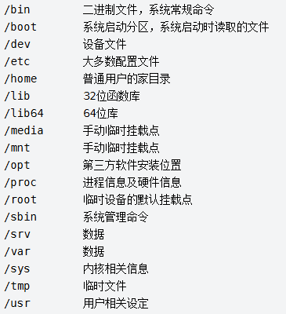
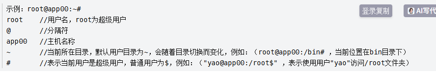

# Linux系统结构

# Linux系统命令行含义

# Linux系统命令

[Linux 常用操作命令大全](https://blog.csdn.net/m0_46422300/article/details/104645072)

# Linux教程

[Linux 命令大全 | 菜鸟教程](https://www.runoob.com/linux/linux-command-manual.html)
